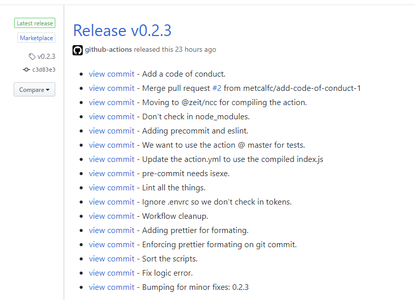

[](https://gitpod.io/#https://github.com/metcalfc/changelog-generator)

# Get a changelog between two references

This Action returns a markdown formatted changelog between two git references. There are other projects that use milestones, labeled PRs, etc. Those are just too much work for simple projects.

I just wanted a simple way to populate the body of a GitHub Release.

<a href="https://github.com/metcalfc/changelog-generator/releases/tag/v4.1.0"></a>

## Inputs

### `mytoken`

A GITHUB_TOKEN with the ability to pull from the repo in question. This is required.

Why do we need `myToken`? Read more here: https://help.github.com/en/actions/automating-your-workflow-with-github-actions/authenticating-with-the-github_token#about-the-github_token-secret

### `head-ref`

The name of the head reference. Default `${{github.sha}}`.

### `base-ref`

The name of the second branch. Defaults to the `tag_name` of the latest GitHub release. *This must be a GitHub release. Git tags or branches will not work.*

### `reverse`

Whether the order of commits should be printed in reverse. Default: 'false'

### `fetch`

Whether this action should pull in all other branches and tags. Default: 'true'

## Outputs

### `changelog`

Markdown formatted changelog.

## Example usage

There are two blocks you will need:

### First block

First you will need to generate the changelog itself. To get the changelog between the SHA of the commit that triggered the action and the tag of the latest release:

```yaml
- name: Generate changelog
  id: changelog
  uses: metcalfc/changelog-generator@v4.1.0
  with:
    myToken: ${{ secrets.GITHUB_TOKEN }}
```

Or, if you have two specific references you want:

```yaml
- name: Generate changelog
  id: changelog
  uses: metcalfc/changelog-generator@v4.1.0
  with:
    myToken: ${{ secrets.GITHUB_TOKEN }}
    head-ref: 'v0.0.2'
    base-ref: 'v0.0.1'
```

If you want to point to a branch containing forward slashes (https://github.com/metcalfc/changelog-generator/issues/179) do the following:

```yaml

# let the checkout action do the fetching
- uses: actions/checkout@v3
  with:
    fetch-depth: 0

- name: Generate changelog
  id: changelog
  uses: metcalfc/changelog-generator@v4.1.0 #TODO: bump this after release
  with:
    myToken: ${{ secrets.GITHUB_TOKEN }}
    head-ref: 'origin/my/branch/with/slashes' #add 'origin/` in front of your branch name
    base-ref: 'v4.1.0'
    fetch: false
```

### Second block

Then you can use the resulting changelog:

```yaml
- name: Get the changelog
  run: |
    cat << "EOF"
    ${{ steps.changelog.outputs.changelog }}
    EOF
```

### Simple output modifications

Some folks have asked if the action can support changing the output. For example:
  * Reverse order *UPDATE* as of 2021/11/22 chronological is the default and it can be reversed by setting `reverse: 'true'` in the workflow.
  * Ignore entries that include this string.
  * Etc

In order to keep this action as simple as possible we aren't planning to add more flags or options. However since the output is just text you can write a command line to do anything you want. In issue #93 we had a user that wanted to list the changelog in reverse order and drop any entries with `gh-pages`. Here is how they can do that but using Bumping as the restrict word because it shows up in this projects history:

```yaml
      - name: Modify the changelog
        id: modified
        run: |
          set -o noglob
          log=$(cat << "EOF" | grep -v Bumping | tac
          ${{ steps.changelog.outputs.changelog }}
          EOF
          )
          log="${log//'%'/'%25'}"
          log="${log//$'\n'/'%0A'}"
          log="${log//$'\r'/'%0D'}"
          echo "log=$log" >> $GITHUB_OUTPUT

      - name: Print the modified changelog
        run: |
          cat << "EOF"
          ${{ steps.modified.outputs.log }}
          EOF
```

You might be wondering about that set of escaping for the `log`. Thats because GitHub Actions doesn't support multiline output. Read more [here](https://github.community/t/set-output-truncates-multiline-strings/16852).

## Example use case

[Generating the release notes for a GitHub Release.](.github/workflows/release.yml)

## Open Discussions for feature requests or questions

Issues are for folks who are actively using the action and running into an "issue" (bug, missing doc, etc).

Feature requests should be in the [discussion section.](https://github.com/metcalfc/changelog-generator/discussions).
Just to set expectations the bar for a new feature getting added is going to be very high. There is a
cost to adding features in the development and maintainance of the feature. So if you want to jump in and
help develop and maintain lets discuss. If you want to fire off feature ideas, go for it. Just understand its
very likely that without someone willing to take up the task, they won't get implemented.

## Keep up-to-date with GitHub Dependabot

Since [Dependabot](https://docs.github.com/en/github/administering-a-repository/keeping-your-actions-up-to-date-with-github-dependabot)
has [native GitHub Actions support](https://docs.github.com/en/github/administering-a-repository/configuration-options-for-dependency-updates#package-ecosystem),
to enable it on your GitHub repo all you need to do is add the `.github/dependabot.yml` file:

```yaml
version: 2
updates:
  # Maintain dependencies for GitHub Actions
  - package-ecosystem: 'github-actions'
    directory: '/'
    schedule:
      interval: 'daily'
```
## Troubleshooting

### Error not found

```
Error: Not Found
```

If you are seeing this error its likely that you do not yet have a GitHub release. You might have a git tag and that shows up in the release tab. The
API this Action uses only works with GitHub Releases. Convert one of your tags to a release and you'll be on your way. You can check out how this
repository uses this action and GitHub releases for an [example](.github/workflows/release.yml).


## Acknowledgements

I took the basic framework for this action from: [jessicalostinspace/commit-difference-action](https://github.com/jessicalostinspace/commit-difference-action). Thanks @jessicalostinspace.
